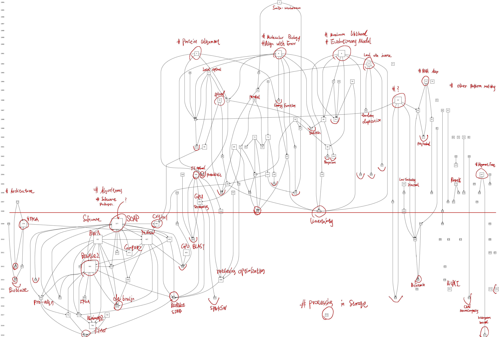

# Working logs 
> This logging behaviour start after July 26th, 2022 by Pan Zhaowu.

## ***Week 4, July to ...***

### ***Tasks***  
- #### Short term
1. - [x] Backtrace the history of sequence alignment.
2. - [x] Learning the usage of Makefile.  
3. - [x] C/C++ review. 
4. - [x] Deploy heterogenous accelerator developing environment( Quartus ).
5. - [x] Test the availability of Intel arria 10 GX ES.
- #### Long term
1.  [ +++++++++=========== ]Comprehensively read the backtrace articles.
2.  [ ==================== ]Read the source code of BWA-MEM
3.  [ +=================== ]Read the source code of BWA-MEM2
4.  [ +=================== ]Read the handbooks of Arria 10 developing
### ***Results***
  
#### **S1-Backtrace**
  According to the keyword searching of ***"((((TI=(sequence alignment)) OR TI=(read alignment)) NOT TI=(multiple)) NOT TI=(phylogenetic)) AND TS=(algorithm)sequence alignment"*** in Web of Science database, I've obtained 900+ entries of article and perform citation analysis in **histcite**, the citation graph of 150 most influential works (sorted by local citation score) are shown as below:

    Among those articles, I selected a few heuristicly to investigate, the list of papers and their's node tag are presented:

- [ ] V. I. Levenshtein, “Binary Codes Capable of Correcting Deletions, Insertions, and Reversals,” Soviet Physics Doklady, vol. 10, pp. 707–710, Nov. 1965.
  > Introducing an algorithm that 
- [ ]  S. B. Needleman and C. D. Wunsch, “A general method applicable to the search for similarities in the amino acid sequence of two proteins,” Journal of Molecular Biology, vol. 48, no. 3, pp. 443–453, Mar. 1970, doi: 10.1016/0022-2836(70)90057-4.

- [ ] M. S. Waterman, T. F. Smith, and W. A. Beyer, “Some biological sequence metrics,” Advances in Mathematics, vol. 20, no. 3, pp. 367–387, Jun. 1976, doi: 10.1016/0001-8708(76)90202-4.

- [ ] T. F. Smith, M. S. Waterman, and W. M. Fitch, “Comparative biosequence metrics,” J Mol Evol, vol. 18, no. 1, pp. 38–46, Jan. 1981, doi: 10.1007/BF01733210.

- [ ] T. F. Smith and M. S. Waterman, “Comparison of biosequences,” Advances in Applied Mathematics, vol. 2, no. 4, pp. 482–489, Dec. 1981, doi: 10.1016/0196-8858(81)90046-4.

- [ ] W. M. Fitch and T. F. Smith, “Optimal sequence alignments,” Proceedings of the National Academy of Sciences, vol. 80, no. 5, pp. 1382–1386, Mar. 1983, doi: 10.1073/pnas.80.5.1382.

- [ ] M. S. Waterman, “Efficient sequence alignment algorithms,” Journal of Theoretical Biology, vol. 108, no. 3, pp. 333–337, Jun. 1984, doi: 10.1016/S0022-5193(84)80037-5.

- [ ] M. A. S. Saqi and M. J. E. Sternberg, “A simple method to generate non-trivial alternate alignments of protein sequences,” Journal of Molecular Biology, vol. 219, no. 4, pp. 727–732, Jun. 1991, doi: 10.1016/0022-2836(91)90667-U.

- [ ] J. Thorne, H. Kishino, and J. Felsenstein, “An Evolutionary Model for Maximum Likelihood Alignment of DNA Sequences,” Journal of Molecular Evolution, vol. 33, pp. 114–124, Aug. 1991, doi: 10.1007/BF02193625.

- [ ] Zuker, “Suboptimal sequence alignment in molecular biology: Alignment with error analysis,” Journal of Molecular Biology, vol. 221, no. 2, pp. 403–420, Sep. 1991, doi: 10.1016/0022-2836(91)80062-Y.

- [ ] M. Schöniger and M. S. Waterman, “A local algorithm for DNA sequence alignment with inversions,” Bltn Mathcal Biology, vol. 54, no. 4, pp. 521–536, Jul. 1992, doi: 10.1007/BF02459633.

- [ ] F. Corpet and B. Michot, “RNAlign program: alignment of RNA sequences using both primary and secondary structures,” Bioinformatics, vol. 10, no. 4, pp. 389–399, Jul. 1994, doi: 10.1093/bioinformatics/10.4.389.

- [ ] C. Notredame and D. G. Higgins, “SAGA: Sequence Alignment by Genetic Algorithm,” Nucleic Acids Res, vol. 24, no. 8, pp. 1515–1524, Apr. 1996, doi: 10.1093/nar/24.8.1515.

- [ ] M. S. Gelfand, A. A. Mironov, and P. A. Pevzner, “Gene recognition via spliced sequence alignment.,” Proc Natl Acad Sci U S A, vol. 93, no. 17, pp. 9061–9066, Aug. 1996.

- [ ] R. Hughey, “Parallel hardware for sequence comparison and alignment,” Bioinformatics, vol. 12, no. 6, pp. 473–479, Dec. 1996, doi: 10.1093/bioinformatics/12.6.473.

- [ ] S. Rajko and S. Aluru, “Space and time optimal parallel sequence alignments,” IEEE Transactions on Parallel and Distributed Systems, vol. 15, no. 12, pp. 1070–1081, 2004, doi: 10.1109/TPDS.2004.86.

- [ ] R. Koike, K. Kinoshita, and A. Kidera, “Probabilistic description of protein alignments for sequences and structures,” Proteins, vol. 56, no. 1, pp. 157–166, Jul. 2004, doi: 10.1002/prot.20067.

- [ ] T. D. Pham and J. Zuegg, “A probabilistic measure for alignment-free sequence comparison,” Bioinformatics, vol. 20, no. 18, pp. 3455–3461, Dec. 2004, doi: 10.1093/bioinformatics/bth426.

- [ ] A. N. Arslan, “Regular expression constrained sequence alignment,” Journal of Discrete Algorithms, vol. 5, no. 4, pp. 647–661, Dec. 2007, doi: 10.1016/j.jda.2007.01.003.

- [ ] G. Lunter, A. Rocco, N. Mimouni, A. Heger, A. Caldeira, and J. Hein, “Uncertainty in homology inferences: Assessing and improving genomic sequence alignment,” Genome Res., vol. 18, no. 2, pp. 298–309, Jan. 2008, doi: 10.1101/gr.6725608.

- [ ] V. Polyanovsky, M. A. Roytberg, and V. G. Tumanyan, “Reconstruction of genuine pair-wise sequence alignment,” J Comput Biol, vol. 15, no. 4, pp. 379–391, May 2008, doi: 10.1089/cmb.2007.0145.
  > Fabricated sequences with prior knowledge of "evolution model" to test the quaility of alignment algorithms, gives insight about the developing of alignment theory itself(though probably useless?)

- [ ] K. Benkrid, Y. Liu, and A. Benkrid, “A Highly Parameterized and Efficient FPGA-Based Skeleton for Pairwise Biological Sequence Alignment,” IEEE Transactions on Very Large Scale Integration (VLSI) Systems, vol. 17, no. 4, pp. 561–570, Apr. 2009, doi: 10.1109/TVLSI.2008.2005314.
  > Developed a cross-platformed accelerating skeleton with parameter to FPGA.   ***What is Handel-C? Is it still popular?***

- [ ] R. Li et al., “SOAP2: An improved ultrafast tool for short read alignment,” Bioinformatics (Oxford, England), vol. 25, pp. 1966–7, Jul. 2009, doi: 10.1093/bioinformatics/btp336.
  > The paper of famous alignment tool SOAP2, related closely to BWA   ***Intensive reading needed.***

- [ ] H. Li and R. Durbin, “Fast and accurate long-read alignment with Burrows-Wheeler transform,” Bioinformatics, vol. 26, no. 5, pp. 589–595, Mar. 2010, doi: 10.1093/bioinformatics/btp698.
  > The paper of famous alignment tool BWA   ***Intensive reading needed.***

- [ ] N. Sebastião, N. Roma, and P. Flores, “Hardware accelerator architecture for simultaneous short-read DNA sequences alignment with enhanced traceback phase,” Microprocessors and Microsystems, vol. 36, no. 2, pp. 96–109, Mar. 2012, doi: 10.1016/j.micpro.2011.05.003.
  > Using FPGA to accelerating the SW algorithm and its backtrack phase, comparing with a synthesizable free softcore on chip.  **High value**

- [ ] B. Langmead and S. L. Salzberg, “Fast gapped-read alignment with Bowtie 2,” Nat Methods, vol. 9, no. 4, Art. no. 4, Apr. 2012, doi: 10.1038/nmeth.1923.
  > The paper of famous alignment tool Bowtie2   ***Intensive reading needed.***

- [ ] M. Abbasi, L. Paquete, A. Liefooghe, M. Pinheiro, and P. Matias, “Improvements on bicriteria pairwise sequence alignment: algorithms and applications,” Bioinformatics, vol. 29, no. 8, pp. 996–1003, Apr. 2013, doi: 10.1093/bioinformatics/btt098.
  > Described two different optimization problem in sequence alignment using mathmetical and game theory(?) approach.

- [ ] N. Neves et al., “BioBlaze: Multi-core SIMD ASIP for DNA sequence alignment,” in 2013 IEEE 24th International Conference on Application-Specific Systems, Architectures and Processors, Jun. 2013, pp. 241–244. doi: 10.1109/ASAP.2013.6567581.
  > Designed an application-specifice instruction-set proccessor using FPGA, utilized both fine and coarse grained parallelism. Implemented a compliation framework based on GCC to ease the programming.  **HARDCORE**

- [x] S. Horwege et al., “Spaced words and kmacs: fast alignment-free sequence comparison based on inexact word matches,” Nucleic Acids Research, vol. 42, no. W1, pp. W7–W11, Jul. 2014, doi: 10.1093/nar/gku398.
  > Alignment-free algorithms, just for additive reading.

- [ ] L. Ji, X. Pu, H. Qu, and G. Liu, “One-dimensional pairwise CNN for the global alignment of two DNA sequences,” Neurocomputing, vol. 149, pp. 505–514, Feb. 2015, doi: 10.1016/j.neucom.2014.08.023.
  > ***Inspite of convolutional neural networks in convention, CNN represent Cellular neural network***   It's said that the time complexity of global sequence alignment could be reduced to **linear** in this long-ignored dynamic system.   ***Including global alignment and similarity computation, FPGA implement is possible.***

- [x] Y. Liu and B. Schmidt, “GSWABE: Faster GPU-accelerated sequence alignment with optimal alignment retrieval for short DNA sequences,” Concurrency and Computation Practice and Experience, vol. 27, Mar. 2015, doi: 10.1002/cpe.3371.
  > Use GPGPU to perform all-to-all alignment, including retrieval. Also investigate a general tiled approach for alignment matrix computational pattern performed also in retrieval.

- [ ] B. Liu, H. Guo, M. Brudno, and Y. Wang, “deBGA: read alignment with de Bruijn graph-based seed and extension,” Bioinformatics, vol. 32, no. 21, pp. 3224–3232, Nov. 2016, doi: 10.1093/bioinformatics/btw371.
  > Use de bruijn graph rebuild the reference genome and align with graph-based seed and extension algorithm to greatly reduce the computational burden caused by repeat regions...   ***The algorithm of de Bruijn graph assembly is still unacknowledged***

- [ ] R. Kaplan, L. Yavits, R. Ginosar, and U. Weiser, “A Resistive CAM Processing-in-Storage Architecture for DNA Sequence Alignment,” IEEE Micro, vol. 37, no. 4, pp. 20–28, 2017, doi: 10.1109/MM.2017.3211121.
  > Using content-addressable associative processing (non-von Neumann computing paradigms) to finds matching base pairs in a fixed number of cycles, regardless of sequence length,but   ***not include the traceback(optimal alignment retrieval) proccess***

- [ ] H. Li, “Minimap2: pairwise alignment for nucleotide sequences,” Bioinformatics, vol. 34, no. 18, pp. 3094–3100, Sep. 2018, doi: 10.1093/bioinformatics/bty191.
  > Gerneral-purpose alignment program to map widely various length of nucleotides to reference database using split-read alignment and concave gap cost. Skipping repetitive regions in long sequence alignment which are the bottleneck of short-read alignment, seed-chain-align.

- [ ] M. Alser, H. Hassan, A. Kumar, O. Mutlu, and C. Alkan, “Shouji: a fast and efficient pre-alignment filter for sequence alignment,” Bioinformatics, vol. 35, no. 21, pp. 4255–4263, Nov. 2019, doi: 10.1093/bioinformatics/btz234.
  > Filter-oriented hardware/software co-design acceleration of short sequence alignment. Using heuristics quickly eliminate some of the dissimilar sequences before using the computationally-expensive optimal alignment algorithms.

#### **Periodical concluding**  
  Backtracking the most influential works accomplished in sequence alignment algorithms, it's not difficult to find that huge amount of efforts are taken into circumventing or optimizing the usage of dynamic programming kernel. 
  
  In circumventing the usage of DP, carefully tuned seed-extension algorithm, bounded edit-distance global alignment with elaborately designed full text index constitutes the vast majority of widely used implements nowadays, but the purge of redundant suboptimal matches is still a huge problem in the stage of seeding, while the existence of other approaches like pre-alignment filter or graph-based alignment( with reference ) is noteworthy, their's hardware affinity is still remain to discuss. 

  In optimizing( or accelerating ) the DP kernel, various kinds of hardware are chosen to cater the feature of this specific task: SIMD instructions in General Processors, SIMT execution in GPGPUs, Systolic arrays, Cellular Neural Network or even Application Specific Instrutions in FPGA and Procesiing-in-Storage architecture are used to exploit the intrinstic characteristics of these hetreogeneous architectures to minimize the time consumption in DP, but scoring and backtracing are two different problem, fast backtracing often accompanied by large memory footprint, which is sidesteped by even most customizable hardware like CAM( probably this procedure is difficult to implement?), to my knowledge, before effective change happens to backtracing algorithm itself, this tradeoff is still unevitable in computing.

  This bactracking progress is coming to a half till July 30th, which go back to a time period around 2008, where consensus upon validity of dynamic programming algorithm in sequence alignment is not yet established. Therefore, a few researches intended to perform validation of dynamic programming and scoring matrix from the prospect of probablistics or optimization theories, and accompanied with various kind of methods which is far from mainstream nowadays, which can give me some qualitative understanding of pitfall and fruitful direction in future researching. 

#### **Some plan about next-steps**
  Some practical experiments is essential to whatever future I encounter. Learning of performance profiling tools is the basic of high performance computing, same as engineering ability.  

  I shall start at running a full process of certain genomic analysis template, and profiling these procedure seperately. Result-oriented code reviewing may have better efficiency than read aimlessly.  

  First I need to obtain a most used genomic analysis streamline and configure that environment, then deploy the task properly.

  Second, I need to learn the profiling tools like perf, then analyze the computing process in streamline mentioned above, compiling a report about the bottleneck and more stuff that out of my anticipation for now.

  Moreover, a heterogeneous acceleration approach is ought to be mastered by me, so some useful work then can be done in this short period of postgraduate life. The usage of git is also important in two different workline( tutor oriented and self-motivated ).

  Above all, there's a few thing need to be done:
  - [ ] Learning git
  - [ ] Learning perf
  - [ ] Have some serious exercises in genomic analysis, instead of look at the code aimlessly
  - [ ] Start to practice paperwriting: in English writing, Latex coding, data visualizing
