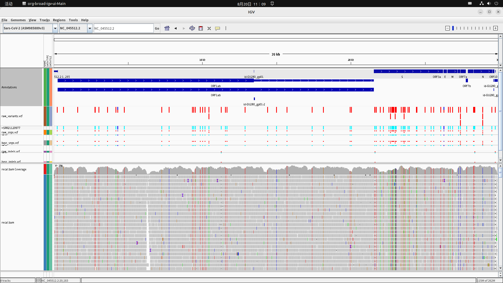

# 工作日志

> 此日志从8月7日由潘炤伍开始记录

## ***八月第二周至...月...周***

### ***任务***  

- #### 短期

1. - [x] 调研有关流程管理框架的信息，尝试学习生信分析中的流程建立和管理  

2. - [x] 寻找NGS分析的最佳实践，并在自己的主机上简单测试、跑通 

3. - [x] 准备性能分析的相关环境、工具和资料书 

4. - [ ] 完成调研，尝试脱离最佳实践，集成新一代工具到流程框架中

5.  **[aborted]** 在Centos中配置一个FPGA开发环境 

- #### 长期

1. **[ +++++++++++++++++++= ]** 根据各个阶段的不同最佳实践，构建自己的计算流程，用现有测序数据跑性能测试和分析

2. **[ +++================= ]** 按照实际需求，系统地学习使用性能分析工具，发掘计算、访存热点后对源代码进行进一步注释

3. **[ +=================== ]** 【继续条件：完成1】阅读BWA-MEM的源代码

4. **[ +=================== ]** 【继续条件：完成2】阅读有关在Arria 10 平台上实现算法异构加速相关的官方手册和补充资料

### ***结果***
  
#### **短期任务概述**
    学习使用例如Galaxy、Snakemake等流程管理框架，并不是为了自己重新设计它们，而是因为性能分析需要，得从它们社区中获取最通用、最佳的实践来进行测试。在完成了测试之后，我打算固定下来几个最为典型的workflow，写死在脚本里进行测试，届时开始perf的实践和代码阅读

#### **短期任务结果**
找到的流程：
### <a href="https://docs.gdc.cancer.gov/Data/Bioinformatics_Pipelines/DNA_Seq_Variant_Calling_Pipeline/#step-1-realigntargetcreator">1. NIH-GDC</a>
#### **A. Genome Alignment**  

原read文件可能为了节约存储空间转为BAM格式，并不代表一开始有比对信息

 **比对**     
DNA-Seq 分析从比对流程开始。单个试样被等分为若干个读序组，通过BWA-MEM算法与参考基因组进行比对。比对完毕后通过Picard、 SortSam 和 MergeSamFiles进行合并。 然后标记因PCR伪影而存在的重复读序以防止下游错误。  
**参考基因组的选择**   
GDC建议所有比对均使用人类参考基因组 GRCh38.d1.vd1 进行。为防止读序错配并将已知存在于人类样本中的病毒的读序引至正确位置，诱饵病毒序列也被包含在该参考基因组中。其中诱饵包括十种人类病毒基因组：人类巨细胞病毒 (CMV)、爱泼斯坦-巴尔病毒 (EBV)、乙型肝炎 (HBV)、丙型肝炎 (HCV)、人类免疫缺陷病毒 (HIV)、人类疱疹病毒 8 (HHV-8) )、人 T 淋巴细胞病毒 1 (HTLV-1)、默克尔细胞多瘤病毒 (MCV)、猿空泡病毒 40 (SV40) 和人乳头瘤病毒 (HPV)

#### **B. Alignment Co-Cleaning**
Co-cleaning 流程使用与同一患者相关的多个BAM文件（即肿瘤 BAM 和正常组织 BAM）作为单独的子流程执行,进一步提高了比对的质量。这个过程的以下两个步骤都是使用 GATK 实现的。


**插入删除(Indel)重比对**   
使用 IndelRealigner 执行插入和删除的局部重比对。 此步骤定位 BAM 文件中包含错配的区域，这通常是由样本相对于参考基因组的插入删除 (indel) 突变引起的。 indel 突变的错位通常会被错误地评分为替换，这会降低下游变体调用步骤的准确性，此步骤的重比对就是为了消除这部分误差。

**碱基对质量矫正（BQSR）**  
重比对之后，使用 BaseRecalibrator 执行基础质量分数重新校准 (BQSR) 。此步骤根据比对中可被检测到的系统偏差调整基础质量分数。 此步骤还提高了下游variant calling算法的准确性。


#### **C. Somatic Variant Calling**  
GDC提供了五个不同的的variant calling流程，但目前对最佳流程的选取在学术界尚且没有共识，因此研究人员应该根据自己需求选择最适合手头数据的变异分析流程。故在此不再赘述。
#### **D. Variant Annotation**
略
#### **E. Mutation Aggregation**
略
#### **F. Aggregated Mutation Masking**  
略

### <a  href="https://github.com/ssadedin/variant_calling_pipeline">2. Bpipe variant calling workflow</a>
该流程基于bpipe建立，参考了<a href="https://github.com/claresloggett/variant_calling_pipeline/">Victorian Life Sciences Computation Initiative (VLSCI), University of Melbourne</a>的变异分析和注释流程，但由于我并没有掌握该框架，尚未具有理解它的能力,之后可以从python编写的原版流程中尝试模仿改造一下。
## **长期任务 8月13日阶段性总结**  
本周我尝试着寻找了一些比较权威的Variant Calling相关的基因分析流程框架，在对各种文献阅读中，我对经典模型中元数据的形式更加熟悉了，也曾尝试在本机上搭建一个Galaxy server，但因为各种原因并未如愿配置好，后来一想可能属于是做了无用功，毕竟我需要的是构建流程本身，而不是为了构建分析框架，浪费了许多时间，之后的工作中，切忌忘了最初的目的然后做感动自己的事。  
此外，找到的两个比较权威的流程中，所使用的所有工具也已经被编译、配置完毕了，下周我可能会需要用工作站着手搭建自己的工作流程，不一定会有现实意义，只求麻雀虽小五脏俱全。然后去进行一些性能测试，因为只有本地环境可以让我能有root权限进行性能分析，且由于内存不够，测试样本参考基因组的物种肯定不能采用人类，所以当前最好的解决办法就是小规模测试，至于仍存在分歧的variant calling下游分析阶段，我会选择一个文档较为丰富的开源工具作为下游。  

至于我未来的工作方向是优化整个流程的哪一个环节，这就由这个性能测试得出的结果决定了，这个测试必须要仔细且力求完备，还有许多知识有待补充：profiling工具的使用、一些底层的硬件知识、甚至是随机过程...


## **长期任务 8月20日阶段性总结** 
本周学习了nextflow的基本语法，并且模仿GATK官方的nextflow最佳实践自己写了一个variant calling全流程的脚本，运行结果符合期望，但不清楚是否具有实际意义。此流程中包括有太多java程序的使用(Picard 和GATK)，其中GATK还貌似在内部集成了hadoop的一些东西，可能会在性能测试上带来许多麻烦。

上图是本脚本关于新冠肺炎病毒的variant calling结果在IGV上的展示，原始测序的FASTQ数据取自NCBI的<a href="https://trace.ncbi.nlm.nih.gov/Traces/index.html?view=run_browser&acc=SRR21120977&display=metadata">SRR21120977</a>,参考基因组采用的是<a href="https://www.ncbi.nlm.nih.gov/nuccore/1798174254/">NC_045512</a>。这个脚本基本可以复现一些病毒学论文的结果了（因为参考基因组小，适合我的工作站），下周我会验证它的正确性，并且尝试重新集成一些别的用C语言写的工具如bcftools等，同时观察他们间的区别。

至于性能监测工具的实验，也需要在验证完正确性之后尽快进行了，在这之前仍需要通过一些小项目练手一下，可能会涉及到写一些经典的循环展开、cache对齐等代码并观察perf输出之类的实验，应该耗时不会太长。

文献综述也会在下周尝试进行书写，可能在格式、表达方式上存在很多不妥，修改上预计会花很多时间
### ***附录***
我的脚本 **Aug 20th 2022**：
```bash
#! /bin/bash

export cpuCNT=8
export ORGANISM=covid
# Temporary hard coded
export readID=SRR21120977
export outputPATH=~/projects/output/${readID}
mkdir -p ~/projects/output/${readID}
# Mocked up readgroup because SRA don't give that
export readGroup="@RG\tID:<SRR21120977>\tLB:<SRR21120977>\tSM:<SRR21120977\tPL:ILLUMINA"

export refPATH=~/projects/data/references
export readPATH=~/projects/data/specimens

export refFILE=${refPATH}/${ORGANISM}/${ORGANISM}.fasta
export readFILE=${readPATH}/${ORGANISM}/${readID}.fastq

################## Initial alignment with bwa-mem##################
bwa mem \
    -t ${cpuCNT} \
    -Y \
    -R ${readGroup} \
    ${refFILE} ${readFILE} \
    > ${outputPATH}/aligned.sam

export aligned_reads=${outputPATH}/aligned.sam
################## Initial alignment with bwa-mem##################


################## Mark Duplicate and sort with gatk##################
#In concerning of brevity, no temp file used in this script
gatk \
    MarkDuplicatesSpark \
    -I ${aligned_reads} \
    -M ${outputPATH}/dedup_metrics.txt \
    -O ${outputPATH}/sorted_dedup.bam 

export sorted_dedup_reads=${outputPATH}/sorted_dedup.bam
################## Mark Duplicate and sort with gatk##################

################## Get metrics from picard##################
export PICARD_JAR=/apps/picard/2.17.11/picard.jar

java -jar ${PICARD_JAR} CollectAlignmentSummaryMetrics R=${refFILE} I=${sorted_dedup_reads} O=${outputPATH}/alignment_metrics.txt

java -jar \
${PICARD_JAR} \
CollectInsertSizeMetrics \
-I ${sorted_dedup_reads} \
-O ${outputPATH}/insert_metrics.txt \
-H ${outputPATH}/insert_size_histogram.pdf 

samtools depth -a ${sorted_dedup_reads} > ${outputPATH}/depth_out.txt
################## Get metrics from picard##################
################## Create dict with picard##################
java -jar ${PICARD_JAR} CreateSequenceDictionary \
R=${refFILE} \
O=${refPATH}/${ORGANISM}/${ORGANISM}.dict
################## Create dict with picard##################

################## Variant Calling using GATK hCaller##################
export input_bam=${sorted_dedup_reads}
gatk HaplotypeCaller \
    -R $refFILE \
    -I $input_bam \
    -O ${outputPATH}/raw_variants.vcf 

################## Variant calling using GATK hCaller##################
################## Variant selecting using GATK########################
export raw_variants=${outputPATH}/raw_variants.vcf
gatk SelectVariants \
	-R $refFILE \
	-V $raw_variants \
	-select-type SNP \
	-O ${outputPATH}/raw_snps.vcf
gatk SelectVariants \
        -R $refFILE \
        -V $raw_variants \
        -select-type INDEL \
        -O ${outputPATH}/raw_indels.vcf
################## Variant selecting using GATK########################

################## SNP filtering##################
export raw_snps=${outputPATH}/raw_snps.vcf 
gatk VariantFiltration \
    -R $refFILE \
    -V $raw_snps \
    -O ${outputPATH}/filtered_snps.vcf \
    -filter-name "QD_filter" -filter "QD < 2.0" \
    -filter-name "FS_filter" -filter "FS > 60.0" \
    -filter-name "MQ_filter" -filter "MQ < 40.0" \
    -filter-name "SOR_filter" -filter "SOR > 4.0" \
    -filter-name "MQRankSum_filter" -filter "MQRankSum < -12.5" \
    -filter-name "ReadPosRankSum_filter" -filter "ReadPosRankSum < -8.0"
################## SNP filtering##################
################## Indel filtering##################
export raw_indels=${outputPATH}/raw_indels.vcf 
gatk VariantFiltration \
    -R $refFILE \
    -V $raw_indels \
    -O ${outputPATH}/filtered_indels.vcf \
	-filter-name "QD_filter" -filter "QD < 2.0" \
	-filter-name "FS_filter" -filter "FS > 200.0" \
	-filter-name "SOR_filter" -filter "SOR > 10.0"
################## Indel filtering##################

################## BQSR##################
export filtered_snps=${outputPATH}/filtered_snps.vcf
export filtered_indels=${outputPATH}/filtered_indels.vcf

gatk SelectVariants \
	--exclude-filtered \
	-V $filtered_snps \
	-O ${outputPATH}/bqsr_snps.vcf
gatk SelectVariants \
    --exclude-filtered \
    -V $filtered_indels \
    -O ${outputPATH}/bqsr_indels.vcf
gatk BaseRecalibrator \
	-R $refFILE \
	-I $input_bam \
	--known-sites ${outputPATH}/bqsr_snps.vcf \
	--known-sites ${outputPATH}/bqsr_indels.vcf \
	-O ${outputPATH}/recal_data.table
gatk ApplyBQSR \
    -R $refFILE \
    -I $input_bam \
    -bqsr ${outputPATH}/recal_data.table \
    -O ${outputPATH}/recal.bam
gatk BaseRecalibrator \
    -R $refFILE \
	-I ${outputPATH}/recal.bam \
    --known-sites ${outputPATH}/bqsr_snps.vcf \
	--known-sites ${outputPATH}/bqsr_indels.vcf \
	-O ${outputPATH}/post_recal_data.table
################## BQSR##################

################## Covariate analysis##################
export recal_table=${outputPATH}/recal_data.table
export post_recal_table=${outputPATH}/post_recal_data.table
gatk AnalyzeCovariates \
	-before $recal_table \
	-after $post_recal_table \
	-plots ${outputPATH}/recalibration_plots.pdf
################## Covariate analysis##################

################## SNPEFF##################
# This package should use later version of java than gatk
export SNPEFF_JAR=/apps/snpEff/snpEff.jar
export snpeff_db="coronavirus"
mkdir -p /apps/snpeff/data
export snpeff_data=/apps/snpeff/data
/usr/bin/java -jar $SNPEFF_JAR -v \
	-dataDir $params.snpeff_data \
	${snpeff_db} \
	$filtered_snps > ${outputPATH}/filtered_snps.ann.vcf
################## SNPEFF##################

################## Sample-wised QC##################
cd ${outputPATH}

/home/pzw/Documents/centShare/panzhaowu/Documents/projects/workflow_templates/nextflow_pipline_VC/bin/parse_metrics.sh ${readID} > ${outputPATH}/report.csv
################## Sample-wised QC##################
```
以下是GDC给出的示例脚本:
##### ***Alignment from fastq to reference with read_group:***
```
bwa mem \
-t 8 \
-T 0 \
-R <read_group> \
<reference> \
<fastq_1.fq.gz> \
<fastq_2.fq.gz> |
samtools view \
-Shb
-o <output.bam> -
```
##### ***Sort alignments***
```
java -jar picard.jar SortSam \
CREATE_INDEX=true \
INPUT=<input.bam> \
OUTPUT=<output.bam> \
SORT_ORDER=coordinate \
VALIDATION_STRINGENCY=STRICT
```
##### ***Different Readgroup merging***
```
java -jar picard.jar MergeSamFiles \
ASSUME_SORTED=false \
CREATE_INDEX=true \                 
[INPUT= <input.bam>]  \
MERGE_SEQUENCE_DICTIONARIES=false \
OUTPUT= <output_path> \
SORT_ORDER=coordinate \
USE_THREADING=true \
VALIDATION_STRINGENCY=STRICT
```
##### ***Mark duplicates***
```
java -jar picard.jar MarkDuplicates \
CREATE_INDEX=true \
INPUT=<input.bam> \
VALIDATION_STRINGENCY=STRICT
```
##### ***Re-alignment target creator***
```
java -jar GenomeAnalysisTK.jar \
-T RealignerTargetCreator \
-R <reference>
-known <known_indels.vcf>
[ -I <input.bam> ]
-o <realign_target.intervals>
```
##### ***Indel realigner***
```
java -jar GenomeAnalysisTK.jar \
-T IndelRealigner \
-R <reference> \
-known <known_indels.vcf> \
-targetIntervals <realign_target.intervals> \
--noOriginalAlignmentTags \
[ -I <input.bam> ] \
-nWayOut <output.map>
```

##### ***Base recalibrator with DBSNP***
```
java -jar GenomeAnalysisTK.jar \
-T BaseRecalibrator \
-R <reference> \
-I <input.bam> \
-knownSites <dbsnp.vcf>
-o <bqsr.grp>
```

##### ***Print reads***
```
java -jar GenomeAnalysisTK.jar \
-T PrintReads \
-R <reference> \
-I <input.bam> \
--BQSR <bqsr.grp> \
-o <output.bam>
```
