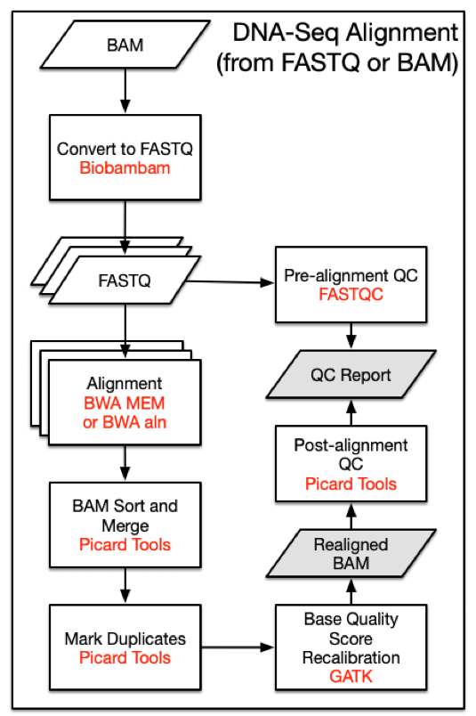

# 工作日记

> 此日志从8月7日由潘炤伍开始记录

## ***八月第二周至...月...周***

### ***任务***  

- #### 短期

1. - [x] 调研有关流程管理框架的信息，尝试学习生信分析中的流程建立和管理  

2. - [ ] 寻找NGS分析的最佳实践，并在自己的主机上简单测试、跑通 

3. - [ ] 准备性能分析的相关环境、工具和资料书 

4. - [ ] 完成调研，尝试脱离最佳实践，集成新一代工具到流程框架中

5. - [ ] 在Centos中配置一个FPGA开发环境 

- #### 长期

1. [ ==================== ] 根据各个阶段的不同最佳实践，构建自己的计算流程，用现有测序数据跑性能测试和分析

2. [ ==================== ] 按照实际需求，系统地学习使用性能分析工具，发掘计算、访存热点后对源代码进行进一步注释

3. [ +=================== ] 【继续条件：完成1】阅读BWA-MEM的源代码

4. [ +=================== ] 【继续条件：完成2】阅读有关在Arria 10 平台上实现算法异构加速相关的官方手册和补充资料

### ***结果***
  
#### **短期任务概述**
    学习使用例如Galaxy、Snakemake等流程管理框架，并不是为了自己重新设计它们，而是因为性能分析需要，得从它们社区中获取最通用、最佳的实践来进行测试。在完成了测试之后，我打算固定下来几个最为典型的workflow，写死在脚本里进行测试，届时开始perf的实践和代码阅读

#### **短期任务结果**
几个找到的流程：
### <a href="https://docs.gdc.cancer.gov/Data/Bioinformatics_Pipelines/DNA_Seq_Variant_Calling_Pipeline/#step-1-realigntargetcreator">1. NIH-GDC</a>
#### **A. Genome Alignment**  

原read文件可能为了节约存储空间转为BAM格式，并不代表一开始有比对信息


> **Alignment Workflow**  
DNA-Seq analysis begins with the Alignment Workflow. Read groups are aligned to the reference genome using one of two   BWA algorithms   [1]. BWA-MEM is used if mean read length is greater than or equal to 70 bp. Otherwise BWA-aln is used. Each read group is aligned to the reference genome separately and all read group alignments that belong to a single aliquot are merged using   Picard Tools   SortSam and   MergeSamFiles. Duplicate reads, which may persist as PCR artifacts, are then flagged to prevent downstream variant call errors.

> **REFERENCE GENOME**   
All alignments are performed using the human reference genome GRCh38.d1.vd1. Decoy viral sequences are included in the reference genome to prevent reads from aligning erroneously and attract reads from viruses known to be present in human samples. Ten types of human viral genomes are included: human cytomegalovirus (CMV), Epstein-Barr virus (EBV), hepatitis B (HBV), hepatitis C (HCV), human immunodeficiency virus (HIV), human herpes virus 8 (HHV-8), human T-lymphotropic virus 1 (HTLV-1), Merkel cell polyomavirus (MCV), Simian vacuolating virus 40 (SV40), and human papillomavirus (HPV).    

##### ***Alignment from fastq to reference with read_group:***
```
bwa mem \
-t 8 \
-T 0 \
-R <read_group> \
<reference> \
<fastq_1.fq.gz> \
<fastq_2.fq.gz> |
samtools view \
-Shb
-o <output.bam> -
```
##### ***Sort alignments***
```
java -jar picard.jar SortSam \
CREATE_INDEX=true \
INPUT=<input.bam> \
OUTPUT=<output.bam> \
SORT_ORDER=coordinate \
VALIDATION_STRINGENCY=STRICT
```
##### ***Different Readgroup merging***
```
java -jar picard.jar MergeSamFiles \
ASSUME_SORTED=false \
CREATE_INDEX=true \                 
[INPUT= <input.bam>]  \
MERGE_SEQUENCE_DICTIONARIES=false \
OUTPUT= <output_path> \
SORT_ORDER=coordinate \
USE_THREADING=true \
VALIDATION_STRINGENCY=STRICT
```
##### ***Mark duplicates***
```
java -jar picard.jar MarkDuplicates \
CREATE_INDEX=true \
INPUT=<input.bam> \
VALIDATION_STRINGENCY=STRICT
```
#### **B. Alignment Co-Cleaning**
> The alignment quality is further improved by the Co-cleaning workflow. Co-cleaning is performed as a separate pipeline as it uses multiple BAM files (i.e. the tumor BAM and normal tissue BAM) associated with the same patient. Both steps of this process are implemented using   GATK.

> **INDEL LOCAL REALIGNMENT**   
Local realignment of insertions and deletions is performed using   IndelRealigner. This step locates regions that contain misalignments across BAM files, which can often be caused by insertion-deletion (indel) mutations with respect to the reference genome. Misalignment of indel mutations, which can often be erroneously scored as substitutions, reduces the accuracy of downstream variant calling steps.

> **BASE QUALITY SCORE RECALIBRATION**  
A base quality score recalibration (BQSR) step is then performed using   BaseRecalibrator. This step adjusts base quality scores based on detectable and systematic errors. This step also increases the accuracy of downstream variant calling algorithms. Note that the original quality scores are kept in the OQ field of co-cleaned BAM files. These scores should be used if conversion of BAM files to FASTQ format is desired.
##### ***Re-alignment target creator***
```
java -jar GenomeAnalysisTK.jar \
-T RealignerTargetCreator \
-R <reference>
-known <known_indels.vcf>
[ -I <input.bam> ]
-o <realign_target.intervals>
```
##### ***Indel realigner***
```
java -jar GenomeAnalysisTK.jar \
-T IndelRealigner \
-R <reference> \
-known <known_indels.vcf> \
-targetIntervals <realign_target.intervals> \
--noOriginalAlignmentTags \
[ -I <input.bam> ] \
-nWayOut <output.map>
```

##### ***Base recalibrator with DBSNP***
```
java -jar GenomeAnalysisTK.jar \
-T BaseRecalibrator \
-R <reference> \
-I <input.bam> \
-knownSites <dbsnp.vcf>
-o <bqsr.grp>
```

##### ***Print reads***
```
java -jar GenomeAnalysisTK.jar \
-T PrintReads \
-R <reference> \
-I <input.bam> \
--BQSR <bqsr.grp> \
-o <output.bam>
```

#### **C. Somatic Variant Calling**  
##### ******
##### ******
##### ******
#### Variant Annotation  
##### ******
##### ******
##### ******
#### Mutation Aggregation  
##### ******
##### ******
##### ******
#### Aggregated Mutation Masking  
##### ******
##### ******
##### ******


#### **长期任务 月日阶段性总结**  


