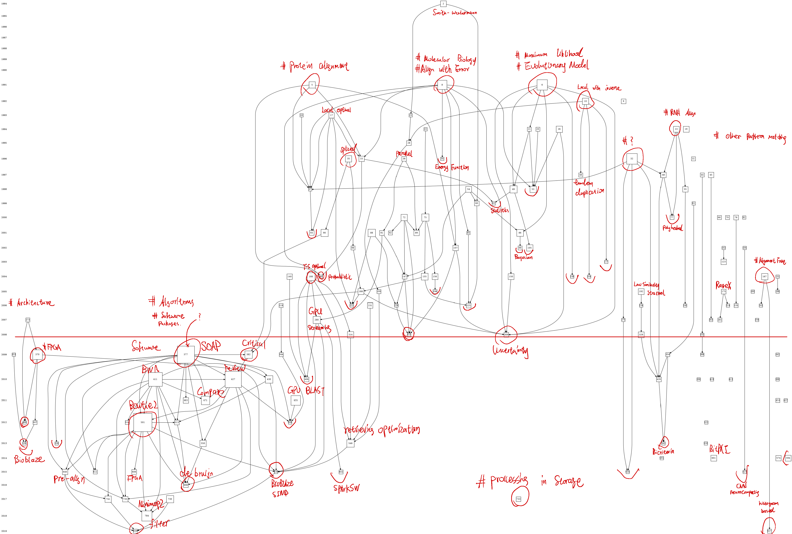

#### LOG FOR MY SELF

#### **Some plans and plains** 

  Some practical experiments is essential to whatever future I encounter. Learning of performance profiling tools is the basic of high performance computing, same as engineering ability.  

  I shall start at running a full process of certain genomic analysis template, and profiling these procedure seperately. Result-oriented code reviewing may have better efficiency than read aimlessly. Currently there's some computing pipeline tools like galaxy, snakemake, nextflow... their convenience in constructing or reproducing computational framework is of little concern to me, the gold standard pipeline in their communities is what I really want to obtain, for which I need to learn them quickly. I need to obtain a most used genomic analysis streamline and configure that environment, then deploy the task properly.

  Second, I need to learn the profiling tools like perf, then analyze the computing process in streamline mentioned above, compiling a report about the bottleneck and more stuff that out of my anticipation for now.

  Moreover, a heterogeneous acceleration approach is ought to be mastered by me, so some useful work then can be done in this short period of postgraduate life. The usage of git is also important in two different workline( tutor oriented and self-motivated ).

  What next is the utmost challenge to me, essential molecular biology and comprehensive understanding of genetic is necessaray to make useful work in the future, study of which could be boring and fruitless in a long period, along with misunderstanding and sarcacisms.

  Above all, there's a few thing need to be done:
  - [x] Learning git
  - [ ] Learning perf
  - [ ] Learning pipeline management tools like Galaxy, nextflow, snakemake
  - [ ] Have some serious exercises in genomic analysis, instead of look at the code aimlessly
  - [ ] Start to practice paperwriting: in English writing, Latex coding, data visualizing
  According to the keyword searching of ***"((((TI=(sequence alignment)) OR TI=(read alignment)) NOT TI=(multiple)) NOT TI=(phylogenetic)) AND TS=(algorithm)sequence alignment"*** in Web of Science database, I've obtained 900+ entries of article and perform citation analysis in **histcite**, the citation graph of 150 most influential works (sorted by local citation score) are shown as below:

    Among those articles, I selected a few heuristicly to investigate, the list of papers and their's node tag are presented:

#### **Periodical concluding**  ***[Aug 1st, 2022]***

  Backtracking the most influential works accomplished in sequence alignment algorithms, it's not difficult to find that huge amount of efforts are taken into circumventing or optimizing the usage of dynamic programming kernel.
  
  In circumventing the usage of DP, carefully tuned seed-extension algorithm, bounded edit-distance global alignment with elaborately designed full text index constitutes the vast majority of widely used implements nowadays, but the purge of redundant suboptimal matches is still a huge problem in the stage of seeding, while the existence of other approaches like pre-alignment filter or graph-based alignment( with reference ) is noteworthy, their's hardware affinity is still remain to discuss.

  In optimizing( or accelerating ) the DP kernel, various kinds of hardware are chosen to cater the feature of this specific task: SIMD instructions in General Processors, SIMT execution in GPGPUs, Systolic arrays, Cellular Neural Network or even Application Specific Instrutions in FPGA and Procesiing-in-Storage architecture are used to exploit the intrinstic characteristics of these hetreogeneous architectures to minimize the time consumption in DP, but scoring and backtracing are two different problem, fast backtracing often accompanied by large memory footprint, which is sidesteped by even most customizable hardware like CAM( probably this procedure is difficult to implement?), to my knowledge, before effective change happens to backtracing algorithm itself, this tradeoff is still unevitable in computing.

  This bactracking progress is coming to a half till July 30th, which go back to a time period around 2008, where consensus upon validity of dynamic programming algorithm in sequence alignment is not yet established. Therefore, a few researches intended to perform validation of dynamic programming and scoring matrix from the prospect of probablistics or optimization theories, and accompanied with various kind of methods which is far from mainstream nowadays, which can give me some qualitative understanding of pitfall and fruitful direction in future researching.

